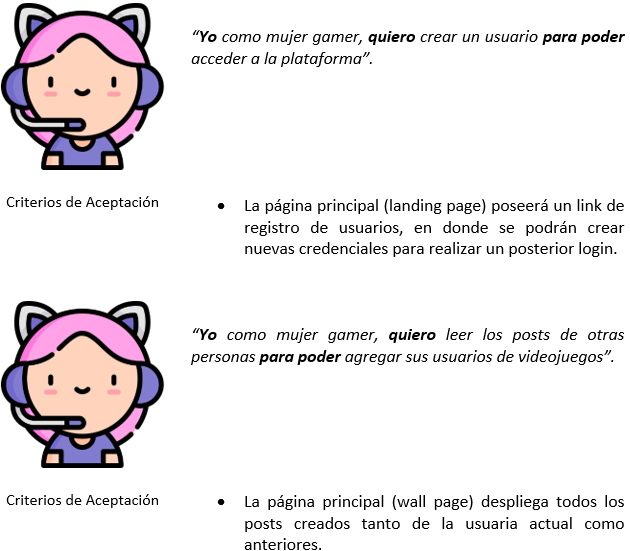
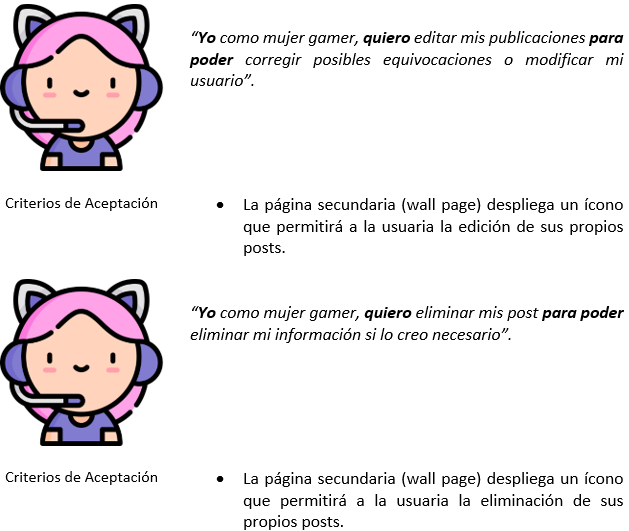
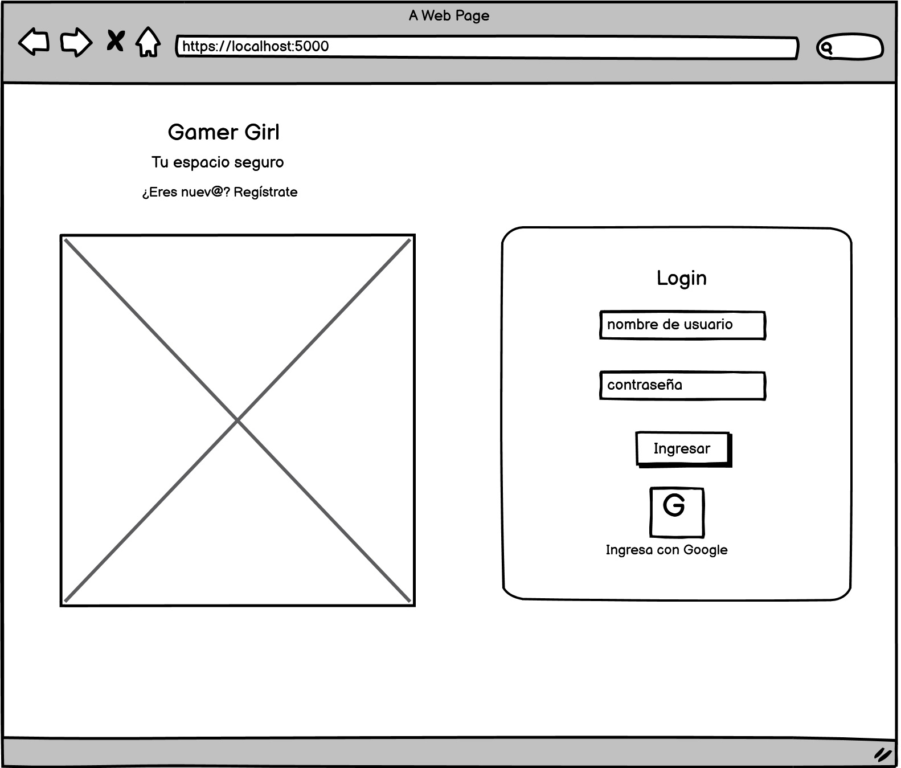
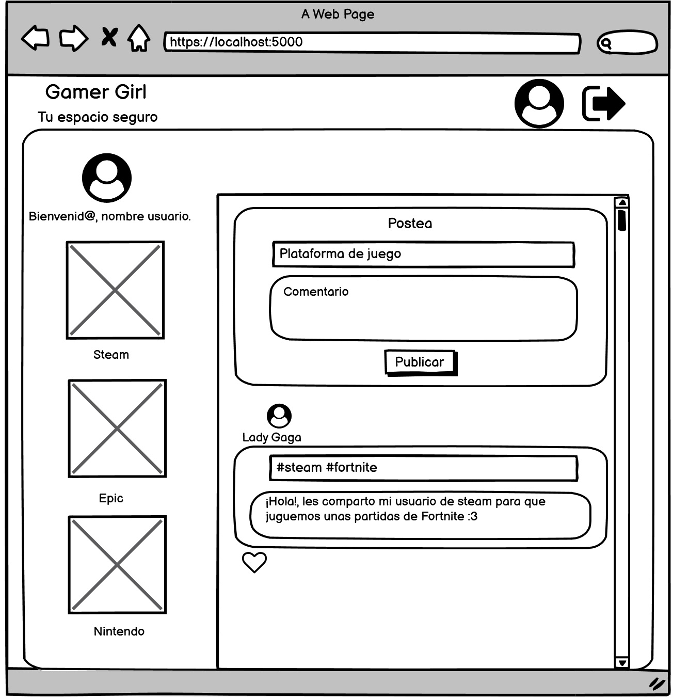
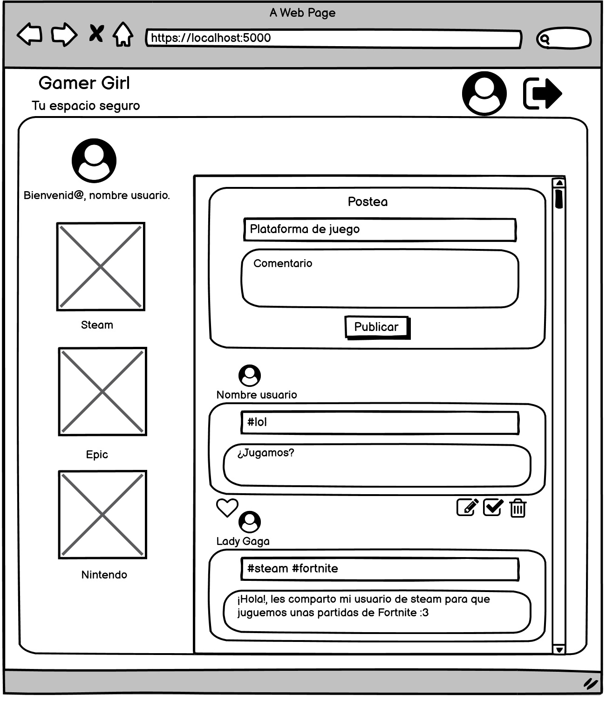
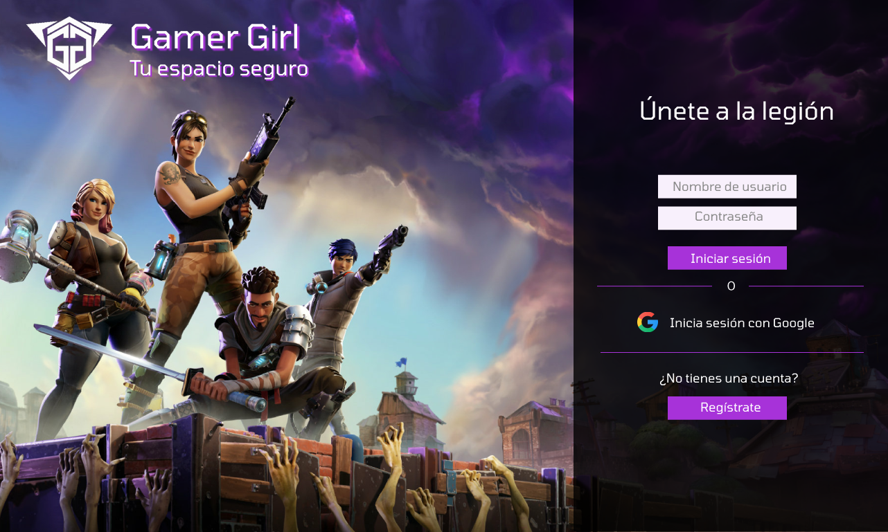
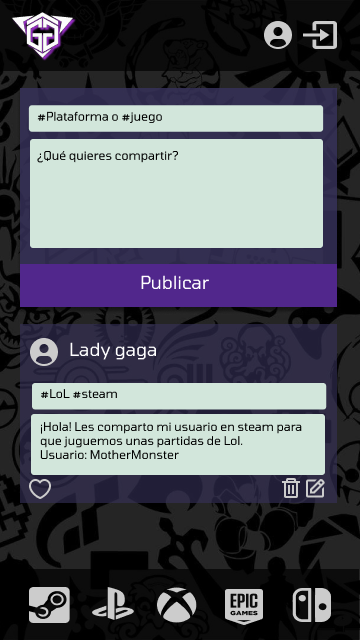
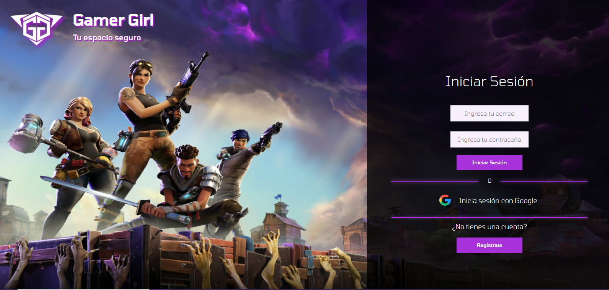
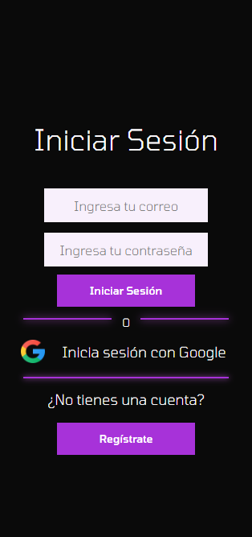
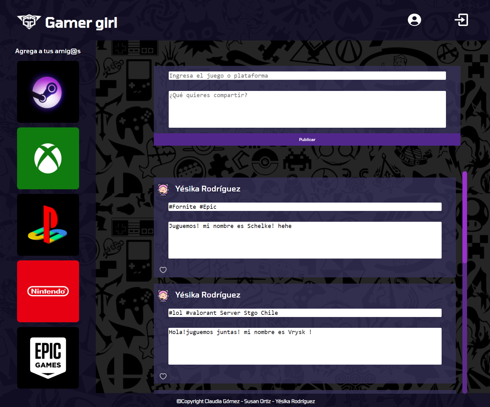

# Social Network
## Índice

* [1. Definición](#1-definición)
* [2. Definición del producto](#2-definición-del-producto)
* [3. Historias de usuario](#3-historias-de-usuario)
* [4. Prototipos](#4-prototipos)
* [5. Test de Usabilidad](#5-test-de-usabilidad)
* [6. Página Finalizada](#6-página-finalizada)
* [7. Link al sitio](#7-link-al-sitio)

***
## 1. Definición  

La página Gamer Girl nace ante la necesidad de nuestras usuarias (mujeres gamers y aficionadas a los videojuegos) de publicar y acceder a información de otras usuarias para compartir sus usuarios y poder jugar en línea con otras mujeres. Esta necesidad nace por la creciente demanda de este tipo de plataformas y la necesidad de crear entornos seguros y respetuosos de entretención.
## 2. Definición del producto

Gamer Girl, es una red social que permitirá a las usuarias registrarse, logear con dichas credenciales o logear directamente con una cuenta asociada a los servicios de Google. Una vez logeadas estas credenciales, la usuaria podrá realizar un post en donde podrá poner con un # el juego de su interés o la plataforma en la que está jugando. Luego, podrá ingresar el contenido y su nombre de usuario. 
Una vez publicada esta información, la usuaria podrá editar o eliminar sus propios post y dar "like" a otras publicaciones. 
Por último, podrá desloguearse de la página al pulsar un ícono de salida en la barra de navegación situado en la parte superior derecha del sitio.

## 3. Historias de usuario 

## 4. Prototipos
## Prototipos de baja fidelidad

*Landing*

*Post*

*Feed*

## Prototipos de alta fidelidad

*Landing Desktop*

*Post Mobile*

## 5. Test de usabilidad 

Durante el desarrollo del proyecto se realizaron entrevistas personales y en grupo a distintos usuarios para probar la usabilidad del prototipo y se llegó a la conclusión de que era necesario modificar algunos elementos para mejorar su comportamiento. A raíz de ello, se agregó lo siguiente:

- Se modificaron los colores de la página.
- Se modificó el fondo de la página.
- Se modificaron los íconos que redirigen a las páginas de las plataformas de juegos.
- Se modificó la opacidad del landing page para facilitar la lectura.
- Se agregaron hover en algunos elementos con colores neón.
## 6. Página finalizada

*Landing Desktop*

*Landing Mobile*

*Wall Desktop*

*Wall Mobile*

## 7. Link al sitio 
https://claudgomezg.github.io/SCL018-social-network/src/

# Creado por 💜:

## *Claudia Gómez, Yésika Rodríguez y Susan Ortiz*
