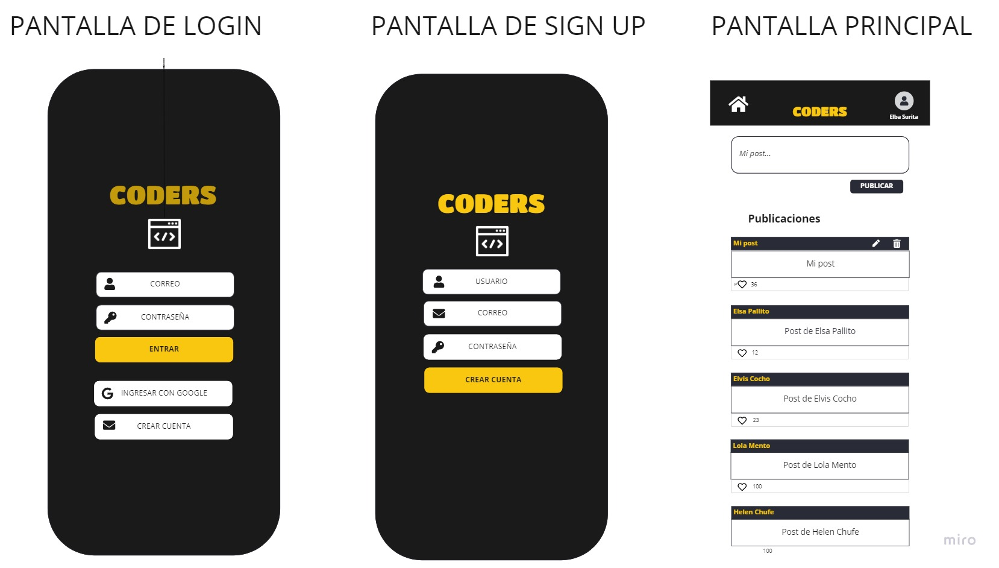

# Social Network: Coders 👩‍💻

## Resumen del proyecto 📌

En este proyecto hicimos una red social orientada a programadores/as que quisieran compartir información de interés con la comunidad. 

La página permite crear una cuenta, autenticarte con esa cuenta o con Google y luego postear, editar y borrar tus propios post. En el muro se pueden visualizar los posts hechos por todas las personas que se han loggeado a la red.

 

## Objetivos de aprendizaje 📚

Este proyecto me permitió construir una single page aplication (SPA). Reforcé el trabajo con módulos de ECMAScript y aprendí a trabajar con Firebase desde cero.

 

## Diseño de la interfaz 	📱

Trabajamos con una perspectiva mobile first y luego hicimos el diseño responsivo para desktop. Quisimos mantener un estilo simple para no sobrecargar la aplicación.

 

### - Prototipo de baja fidelidad  

*Hecho en Miro:*

 

## Desarrollado con: 	🛠️ 
HTML, CSS, Vainilla Javascript y Firebase.
 

## Futuras actualizaciones 🎯
Nos gustaría añadir la opción de publicar comentarios en los post y también hacer más intuitiva la funcionalidad de edición.

 

##  Support 🤝
Bienvenidas sean las contribuciones, sugerencias y comentarios que tengas para este proyecto.

Deja una ⭐️si te gustó 💜
